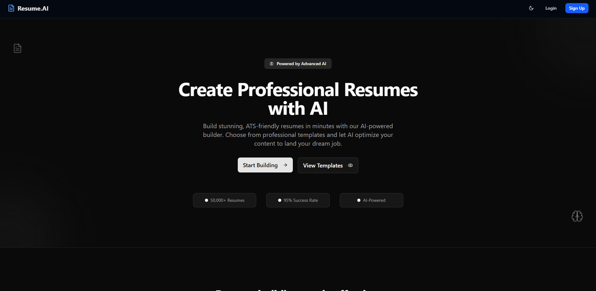
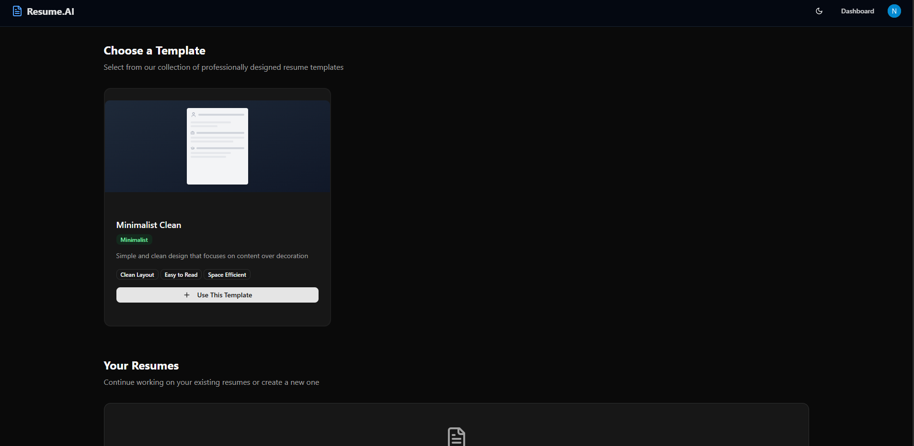
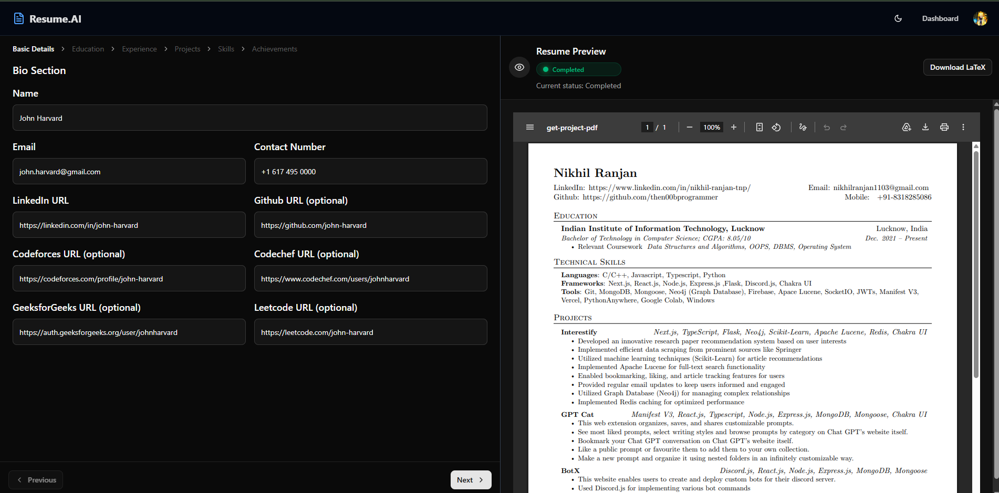
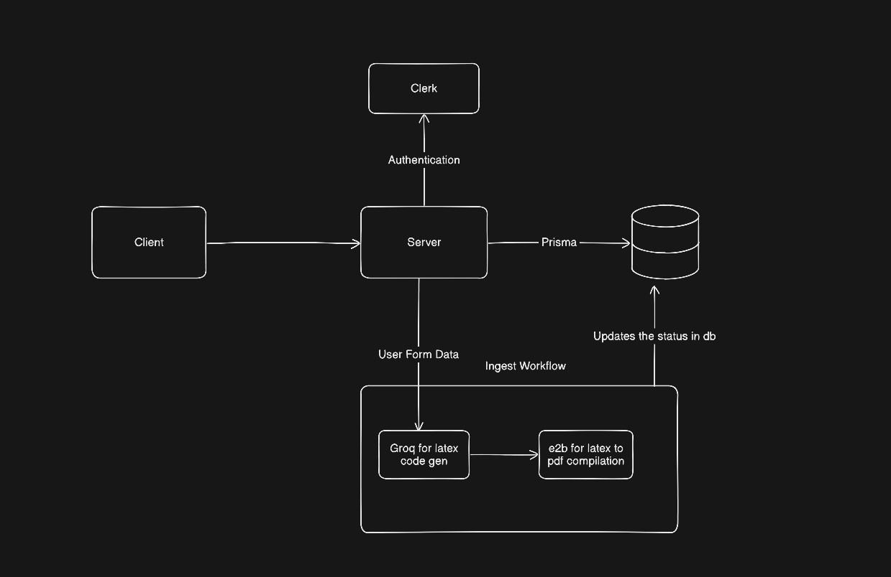

# Resume.AI

An AI-powered resume builder that generates and compiles professional LaTeX resumes from structured user input entirely in the browser. Both the compiled resume in pdf and latex can be downloaded

---

## What it does

Making a professional resume for your profile is always complicated task, not because of the latex code itself but also in finding the right template, so for solving that purpose I created a Resume.AI. An AI powered website which generates latex code using groq llm, compiles the latex code using a safe e2b sandbox environment and displays the pdf right in your browser. A mix of simple form builder and overleaf.

On the first day of release it got **10+ active users**.

---

## Screenshots

**Homepage**



**Dashboard — browse & create projects**



**Resume form editor**



---

## Tech Stack

| Tool | Purpose |
|------|---------|
| Next.js 15 (App Router) | Frontend + API routes |
| Clerk | Authentication |
| Inngest | Background job orchestration |
| Groq + LangChain | LLM-based LaTeX generation |
| E2B Code Interpreter | Remote sandboxed PDF compilation |
| Neon Postgres + Prisma | Database and ORM |
| React Query | Client-side data fetching and caching |

---

## Getting Started

### Prerequisites

- Node.js 18+
- A [Neon](https://neon.tech) Postgres database
- A [Clerk](https://clerk.dev) application
- A [Groq](https://console.groq.com) API key
- An [E2B](https://e2b.dev) API key
- An [Inngest](https://inngest.com) account (or local dev server)

### Installation

```bash
git clone https://github.com/distroaryan/resume.ai.git
cd resume.ai
npm install
```

### Environment Variables

Create a `.env.local` file in the project root and fill these variables with your own API Keys

```env
# Database
DATABASE_URL=

# Clerk
NEXT_PUBLIC_CLERK_PUBLISHABLE_KEY=
CLERK_SECRET_KEY=

# Groq
GROQ_API_KEY=

# E2B
E2B_API_KEY=

# Inngest (required for local configuration of Inngest environment)
INNGEST_DEV=1
```

### Database Setup

```bash
npx prisma generate
npx prisma db push
```

### Run Locally

```bash
# Start the Next.js dev server
npm run dev

# In a separate terminal, start the Inngest dev server
npx inngest-cli@latest dev
```

The app will be available at `http://localhost:3000`.

---

## Architecture Overview



The core workflow is fully asynchronous:

```
User submits resume form
        │
        ▼
generateProjectAndCompileAction (Server Action)
        │
        ├── Inngest Step 1: Groq rewrites LaTeX → saved to DB
        └── Inngest Step 2: E2B compiles LaTeX → PDF saved to DB
                │
                ▼
Client polls checkProjectStatus → PDF rendered in editor
```

- **New projects** are seeded from pre-built templates on disk (`/templates/{name}/main.tex` + `main.pdf`).
- **Authentication** is handled entirely by Clerk — no user data is stored in the application database.
- **Project state** is tracked via a `status` field (`pending → Processing → Completed / Failed`).
- **Backend logic** lives in Next.js Server Actions (`src/action.ts`) — no traditional REST API routes except `GET /api/get-project-pdf` for binary PDF serving.

For full architecture documentation and data flow diagrams, see [`Architecture`](./docs/architecture.md).  
For open issues and contribution opportunities, see [`Contribution`](./docs/contribution.md).

---

## Testing

The project uses **[Vitest](https://vitest.dev/)** for unit testing. All external dependencies (Clerk, Prisma, Inngest, `fs`) are fully mocked so tests run in isolation — no real database or API keys required.

### Test Files

| File | What it tests |
|------|---------------|
| `src/action.test.ts` | All five server actions: auth guards, validation, happy paths |
| `src/app/api/get-project-pdf/route.test.ts` | PDF route: missing/invalid UUID (400), not found (404), success (200) |

### Running Tests

```bash
npm run test
```

Tests run in Node environment and complete in under 1 second.

---

## CI/CD Pipeline

A GitHub Actions workflow (`.github/workflows/ci.yml`) runs automatically on every **push** and **pull request** to `main`.

### What the pipeline does

```
Push / PR to main
      │
      ▼
┌─────────────────────────────┐
│  ubuntu-latest / Node 20    │
│  1. npm ci                  │
│  2. npm run lint            │
│  3. npm run test            │
└─────────────────────────────┘
```

### Key design decisions

- **`npm ci`** (not `npm install`) is used to ensure a reproducible, lock-file-exact install on every run.
- **Lint runs before tests** so style/type issues are caught first.
- No environment secrets are needed — all dependencies are mocked in tests.

---

## Contributing

Contributions are welcome. Please open an issue before submitting a pull request for significant changes. See [`Contribution`](./docs/contribution.md) for a list of known improvements and contribution guidelines.

---

## License

This project is licensed under the [MIT License](./LICENSE).